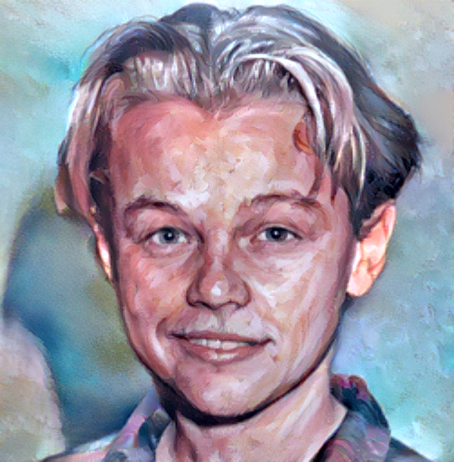

# STROTSS

See the original code and links to paper at https://github.com/nkolkin13/STROTSS

Usage:
```
python strotss.py <content> <style> [--weight 1.0] [--output strotss.png] [--device "cuda:0"]
```

<p align="center">
  
  
  
</p>
